# GoLang Concurrency 101
 

---

## Concurrency 

* Making progress on more than one task simultaneously.
* Composition of independently executing components.
* Concurrency is especially important when designing systems (beyond simple tools).
* Golang is a high-level programming language with high-level concurrency primitives.

---

## Concepts

* Event-driven systems
* Asynchronous systems
* Concurrency*
* Parallelism

---

## Goal

* Become better at writing ***idiomatic Go***
* Learn Go lang concurrency constructs
* Understand and use Go lang concurrency patterns effectively

---


## Idiomatic Go


1. Orthogonality

2. Simplicity

3. Readability


---

## Orthogonality

*pieces are independent from each other; changes to one part, a type, package, program, etc, have minimal to no effect on other parts*

---

[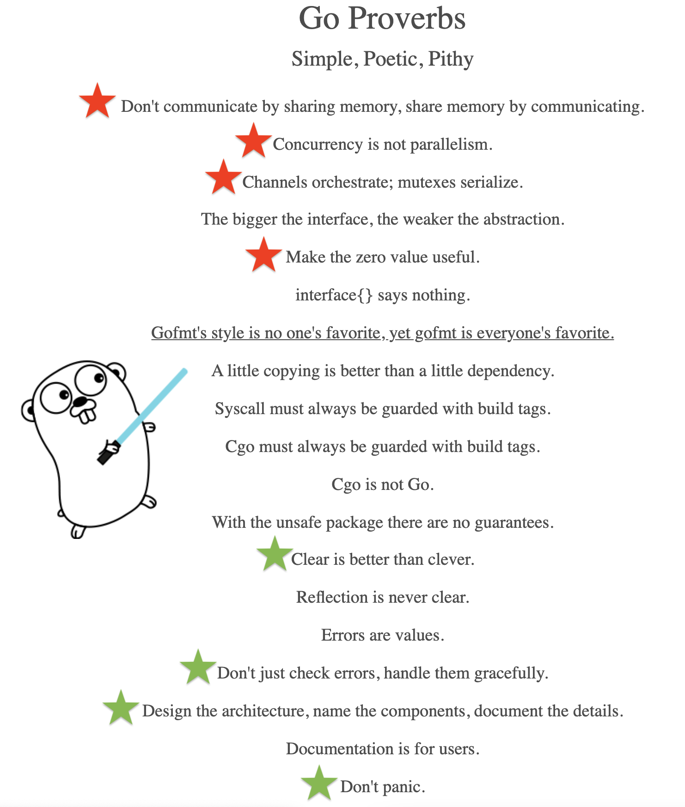](https://go-proverbs.github.io/) 

---

## Concurrency vs Parallelism

* Concurrency is a software design concept
    * a way to structure software, so it interacts cleanly with the real world
* Parallelism is an execution concept 
    * a program with concurrent design running tasks in parallel

[](https://play.golang.org/p/YRFxwXSLpPb) [](https://rafalgolarz.com/blog/2018/07/21/what_are_goroutines)


---

## Concurrency

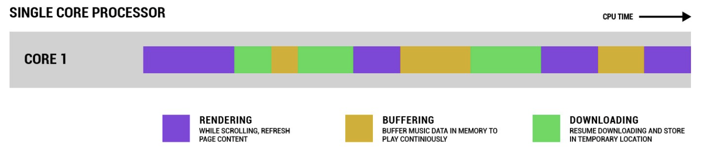

---

## Parallelism
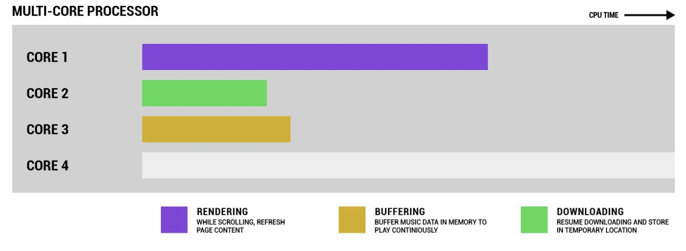

---

## Event-Driven & Asynchronous

* Event-driven: a programming paradigm in which the flow of the program is determined by events. 
    * Such as user interactions, sensor outputs, or messages from other programs or threads.
* Asynchronous programming is synonymous - events can happen asynchronously. 

---

## Go Concurrency

* Goroutines
* Channels
* Mutexes* (serializing concurrent access)

```markdown
go func() {
  for {
    select {
      case <- events_1:
        // handle event 1
      case <- events_2:
        // handle event 2
      case <- events_3:
       // handle event 3 
    }
  }
}()
```

---


# Goroutines

* Like threads conceptually - run independently
* Can leaks resources if not terminated properly

[](https://play.golang.org/p/L8Ehlaz5b1r)

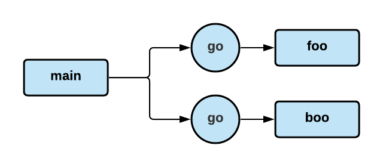

---

# Channels


* Communication
* Blocking (send and receive)
* Synchronization [*](https://play.golang.org/p/QWmjK6TNmND)
* `select` with multiple channels [*](https://play.golang.org/p/ZNn2PdY_Xv2)

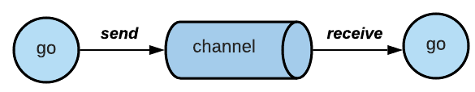
[](https://play.golang.org/p/7WU-Fsvr23m)

---

## Example 1

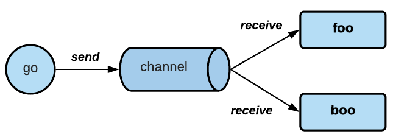


---

## Fan Out Pattern

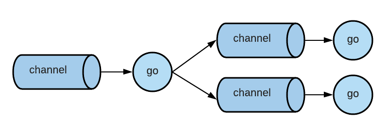

---

## Fan In Pattern

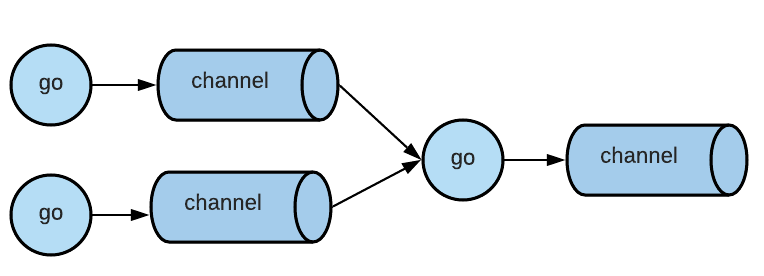

--- 

## Example 2

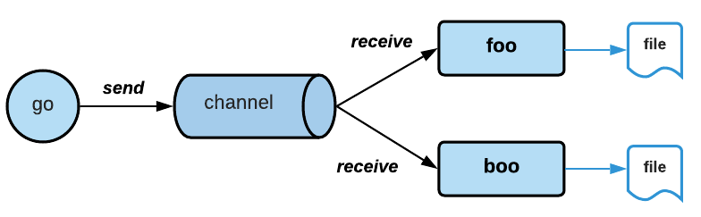

---

# Synchronization Events

***Cancellation***

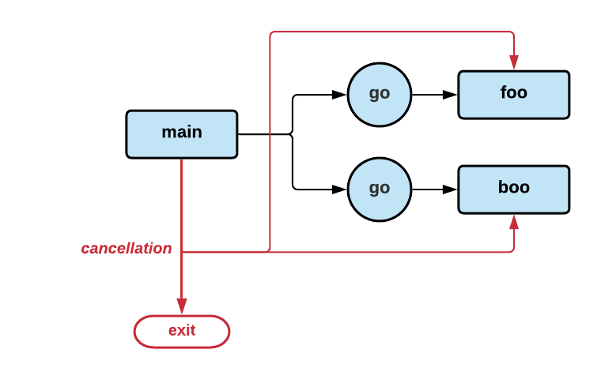

--- 

# Synchronization Events

***Cancellation Acknowledgement***

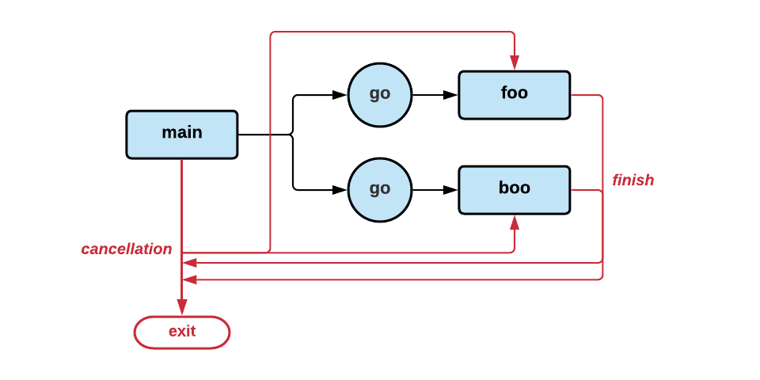

--- 

## Concurrency is not parallelism

---


## Channels orchestrate; mutexes serialize

---

## Make the zero value useful

---


# Resources

[Go Proverbs](https://go-proverbs.github.io/)
[Go Concurrency Patterns](https://www.youtube.com/watch?v=f6kdp27TYZs)
[Concurrency is Not Parallellism](https://www.youtube.com/watch?v=oV9rvDllKEg) 
[Idiomatic Go](https://about.sourcegraph.com/go/idiomatic-go/)


 


